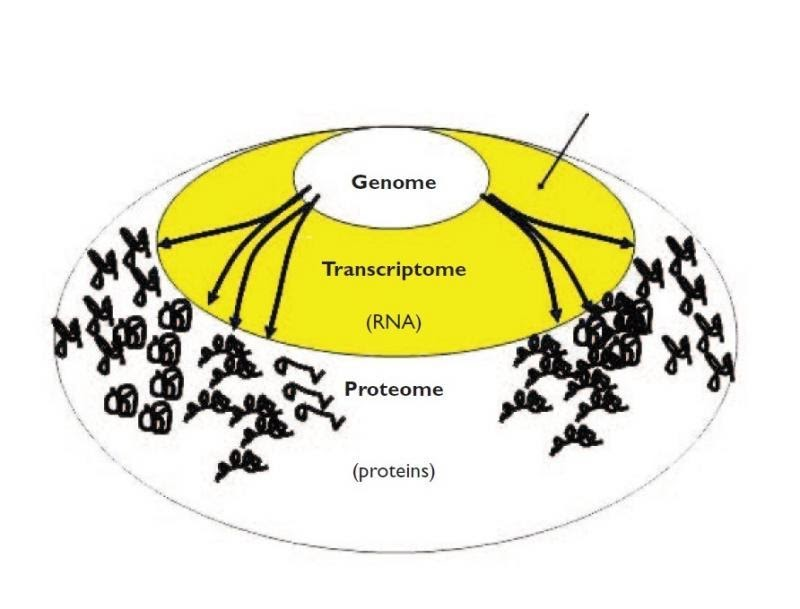
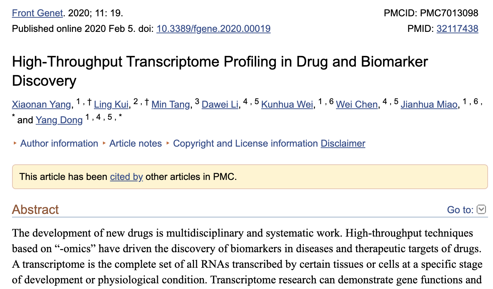
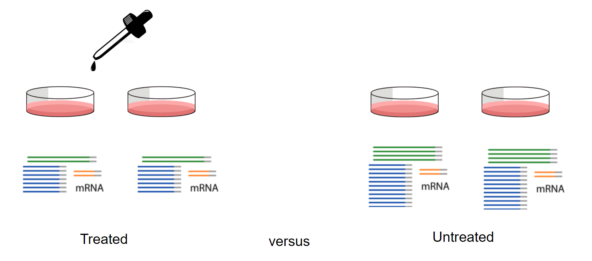
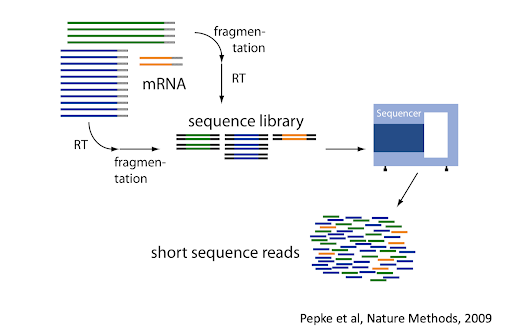
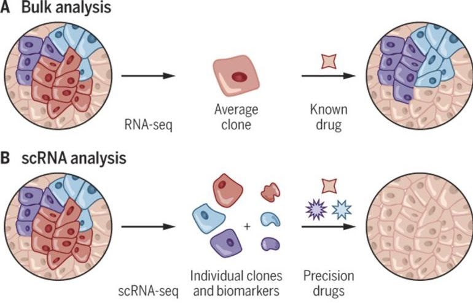
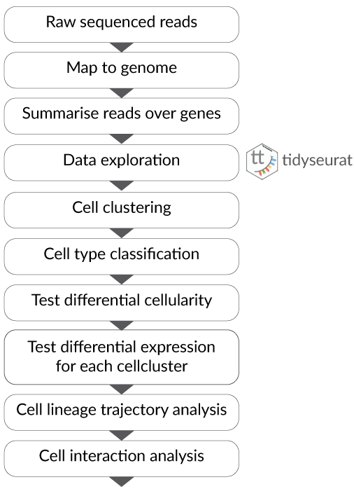
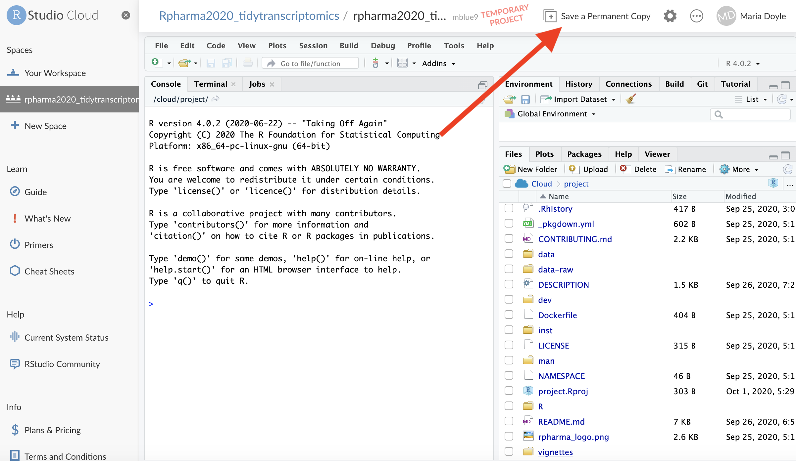

```{r, include = FALSE}
knitr::opts_chunk$set(
  collapse = TRUE,
  comment = "#>"
)
```

```{r, echo=FALSE, out.width = "100px"}
knitr::include_graphics("../inst/vignettes/tidybulk_logo.png")
```

# Schedule

- Part 1 Bulk RNA-seq Core
- Part 2 Bulk RNA-seq Extended
- Part 3 Single-cell RNA-seq

The format is a few introductory slides, then demos, exercises plus Q&A
<br>
<br>

# What is transcriptomics?

“The transcriptome is the set of all RNA transcripts, including coding and non-coding, in an individual or a population of cells”

_Wikipedia_

```{r, echo=FALSE, out.width = "600px"}

```

# Why use transcriptomics?

- Genome (DNA) pretty stable
- Proteome (proteins) harder to measure
- Transcriptome (RNA) can measure changes in expression of thousands of coding and non-coding transcripts
<br>
<br>
```{r, echo=FALSE, out.width = "600px"}

```

# Possible experimental design

```{r, echo=FALSE, out.width = "600px"}

```

# How does transcriptomics work?

```{r, echo=FALSE, out.width = "600px"}

```

# Types of transcriptomic analyses

* **Differential expression**  
* **Cell type composition**  
* Alternative splicing  
* Novel transcript discovery  
* Fusions identification  
* Variant analysis  
<br>
Topics in bold we will see in this workshop
<br>
<br>

# Bulk RNA sequencing differential expression workflow

```{r, echo=FALSE, out.width = "600px"}
knitr::include_graphics("../inst/vignettes/RPharma2020pipeline-01.png")
```

# Differences between bulk and single-cell RNA sequencing

```{r, echo=FALSE, out.width = "600px"}

```

_Shalek and Benson, 2017_

# Single-cell RNA sequencing analysis workflow

```{r, echo=FALSE, out.width = "600px"}

```

# Getting started 

## Cloud

Easiest way to run this material. Only available during workshop.  
 * You should have received an invite to join the classroom in the R in Pharma Organization space in RStudio Cloud.   
 * **Make a copy of the project** as shown in the screenshot below  
 * Open `tidytranscriptomics.Rmd` in `vignettes` folder
 
```{r, echo=FALSE, out.width = "600px"}

```
 


## Local

See instructions [here](https://stemangiola.github.io/rpharma2020_tidytranscriptomics/index.html#workshop-package-installation) if you wnat to install on your own computer. We recommend using the Cloud during the RPharma workshop and this if you want to run the material after the workshop.


## References
