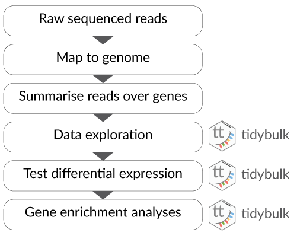

```{r, include = FALSE}
knitr::opts_chunk$set(
  collapse = TRUE,
  comment = "#>"
)
```

# Part 1 Bulk RNA-seq Core

This workshop will present how to perform analysis of RNA sequencing data following the tidy data paradigm [@wickham2014tidy]. The tidy data paradigm provides a standard way to organise data values within a dataset, where each variable is a column, each observation is a row, and data is manipulated using an easy-to-understand vocabulary. Most importantly, the data structure remains consistent across manipulation and analysis functions.

This can be achieved for RNA sequencing data with the [tidybulk](https://stemangiola.github.io/tidybulk/), [tidyHeatmap](https://stemangiola.github.io/tidyHeatmap) [@mangiola2020tidyheatmap] and [tidyverse](https://www.tidyverse.org/) [@wickham2019welcome] packages. The tidybulk package provides a tidy data structure and a modular framework for bulk transcriptional analyses. tidyHeatmap provides a tidy implementation of ComplexHeatmap. These packages are part of the tidytranscriptomics suite that introduces a tidy approach to RNA sequencing data representation and analysis


### Acknowledgements
This material was adapted from an R for RNA sequencing workshop first run [here](http://combine-australia.github.io/2016-05-11-RNAseq/). Use of the airway and pasilla datasets was inspired by the [DESeq2 vignette](http://bioconductor.org/packages/devel/bioc/vignettes/DESeq2/inst/doc/DESeq2.html).

```{r, echo=FALSE, out.width = "100px"}
knitr::include_graphics("../inst/vignettes/tidybulk_logo.png")
```


## Introduction
Measuring gene expression on a genome-wide scale has become common practice over the last two decades or so, with microarrays predominantly used pre-2008. With the advent of next generation sequencing technology in 2008, an increasing number of scientists use this technology to measure and understand changes in gene expression in often complex systems. As sequencing costs have decreased, using RNA sequencing to simultaneously measure the expression of tens of thousands of genes for multiple samples has never been easier. The cost of these experiments has now moved from generating the data to storing and analysing it.

There are many steps involved in analysing an RNA sequencing dataset. The main steps for a differential expression analysis are shown in the figure below. Sequenced reads are aligned to a reference genome, then the number of reads mapped to each gene can be counted. This results in a table of counts, which is what we perform statistical analyses on in R. While mapping and counting are important and necessary tasks, today we will be starting from the count data and showing how differential expression analysis can be performed in a friendly way using tidybulk.

```{r, echo=FALSE, out.width = "70%"}

```

First, let’s load all the packages we will need to analyse the data. Note that you should load the *tidybulk* library after the tidyverse core packages for best integration.

```{r message=FALSE, warning=FALSE}
# load libraries

# dataset
library(airway)

# annotation
library(org.Hs.eg.db)
library(org.Dm.eg.db)

# tidyverse core packages
library(tibble)
library(dplyr)
library(tidyr)
library(readr)
library(stringr)
library(ggplot2)

# tidyverse-friendly packages
library(tidyHeatmap)
library(tidybulk)
library(ggrepel)
library(plotly)
```

Plot settings. Set the colours and theme we will use for our plots.

```{r}
# Use colourblind-friendly colours
friendly_cols <- dittoSeq::dittoColors()

# Set theme
custom_theme <-
  list(
    scale_fill_manual(values = friendly_cols),
    scale_color_manual(values = friendly_cols),
    theme_bw() +
      theme(
        panel.border = element_blank(),
        axis.line = element_line(),
        panel.grid.major = element_line(size = 0.2),
        panel.grid.minor = element_line(size = 0.1),
        text = element_text(size = 12),
        legend.position = "bottom",
        aspect.ratio = 1,
        strip.background = element_blank(),
        axis.title.x = element_text(margin = margin(t = 10, r = 10, b = 10, l = 10)),
        axis.title.y = element_text(margin = margin(t = 10, r = 10, b = 10, l = 10))
      )
  )
```

### Airway RNA sequencing dataset
Here we will perform our analysis using the data from the *airway* package. The airway data comes from the paper by [@himes2014rna]; and it includes 8 samples from human airway smooth muscle cells, from 4 cell lines. For each cell line treated (with dexamethasone) and untreated (negative control) a sample has undergone RNA sequencing and gene counts have been generated.

### Setting up the data

The airway data is stored as a *RangedSummarizedExperiment* object. We can convert a SummarizedExperiment object into a tidybulk tibble, which is the tidyverse table format.

In this workshop we will be using the tidyverse pipe `%>%`. This 'pipes' the output from the command on the left into the command on the right/below. Using the pipe is not essential but it reduces the amount of code we need to write when we have multiple steps (as we'll see later). It also can make the steps clearer and easier to see. For more details on the pipe see [here](https://r4ds.had.co.nz/pipes.html).

```{r}
# load airway RNA sequencing data
data(airway)

# convert to tidybulk tibble
counts_airway <-
	airway %>%
	tidybulk()
```

We can type the name of the object to view.

```{r}
counts_airway
```

The `counts_tt` object contains information about genes and samples, the first column has the Ensembl gene identifier, the second column has the sample identifier and the third column has the gene transcription abundance expressed in number of reads aligning to the gene in each experimental sample. The remaining columns include sample-wise information. The dex column tells us whether the samples are treated or untreated and the cell column tells us what cell line they are from.

We can shorten the sample names. We can remove the SRR1039 prefix that's present in all of them, as shorter names can fit better in some of the plots we will create. We can use `mutate()` together with `str_replace()` to remove the SRR1039 string from the sample column.

```{r}
counts_format <- counts_airway %>%
  mutate(sample=str_remove(sample, "SRR1039"))
```


### Adding gene symbols

We can get the gene symbols for these Ensembl gene ids using the Bioconductor annotation package for human, `org.Hs.eg.db` and add them as a column using `mutate` again.

```{r}
counts_tt <- counts_format %>% mutate(symbol = mapIds(org.Hs.eg.db, keys = as.character(feature), keytype = "ENSEMBL", column="SYMBOL", multiVals = "first"))
counts_tt
```

With tidyverse, all above operations can be linked with the `%>%`, as shown below. This has the benefits that

* no temporary variables need to be created
* less typing is required
* the steps can be seen more clearly.

```{r}
counts_tt <- 	
	airway %>%
	tidybulk() %>%
	mutate(sample=str_remove(sample, "SRR1039")) %>%
	mutate(symbol = AnnotationDbi::mapIds(org.Hs.eg.db::org.Hs.eg.db, keys = as.character(feature), keytype = "ENSEMBL", column="SYMBOL", multiVals = "first"))
```

From this tidybulk tibble, we can perform differential expression analysis with the tidybulk package.

## Filtering lowly transcribed genes  
Genes with very low counts across all libraries provide little evidence for differential expression and they interfere with some of the statistical approximations that are used later in the pipeline. They also add to the multiple testing burden when estimating false discovery rates, reducing power to detect differentially expressed genes. These genes should be filtered out prior to further analysis.

Tidybulk `keep_abundant` can use the *edgeR* `filterByExpr` function described in [@law2016rna] to keep the genes with adequate abundance for differential expression testing. By default, this will keep genes with ~10 counts in a minimum number of samples, the number of the samples in the smallest group. In this dataset the smallest group size is four (as we have four dex-treated samples vs four untreated). Alternatively, we could use `identify_abundant` to identify which genes are abundant or not (TRUE/FALSE), rather than just keeping the abundant ones. 

```{r}
# Filtering counts
counts_filtered <- counts_tt %>% keep_abundant(factor_of_interest=dex)

# take a look
counts_filtered
```
After running `keep_abundant` we have a column called `.abundant` containing TRUE  (`identify_abundant` would have TRUE/FALSE).

## Scaling counts to normalise

Scaling of counts, normalisation, is performed to eliminate uninteresting differences between samples due to sequencing depth or composition. In the tidybulk package the function `scale_abundance` generates scaled counts, with scaling factors calculated on abundant (filtered) transcripts and applied to all transcripts. We can choose from different normalisation methods. Here we will use the default, TMM, [@robinson2010scaling]. TMM normalisation (and most scaling normalisation methods) scale relative to one sample.

```{r}
# Scaling counts
counts_scaled <- counts_filtered %>% scale_abundance()

# take a look
counts_scaled
```

After we run `scale_abundance` we should see some columns have been added at the end. The `counts_scaled` column contains the scaled counts.

We can visualise the difference of abundance densities before and after scaling. As tidybulk output is compatible with tidyverse, we can simply pipe it into standard tidyverse functions such as `filter`, `pivot_longer` and `ggplot`. We can also take advantage of ggplot's `facet_wrap` to easily create multiple plots.

```{r out.width = "70%"}
counts_scaled %>%
	pivot_longer(cols = c("counts", "counts_scaled"), names_to = "source", values_to = "abundance") %>%
	ggplot(aes(x=abundance + 1, color=sample)) +
	geom_density() +
	facet_wrap(~source) +
	scale_x_log10() +
	custom_theme
```

In this dataset the distributions of the counts are not very different to each other before scaling but scaling does make the distributions more similar. If we saw a sample with a very different distribution we may need to investigate it.

As tidybulk smoothly integrates with ggplot2 and other tidyverse packages it can save on typing and make plots easier to generate. Compare the code for creating density plots with tidybulk versus standard base R below (standard code adapted from [@law2016rna]).

**tidybulk**

```{r eval=FALSE}
# tidybulk
airway %>%
	tidybulk() %>%
    keep_abundant(factor_of_interest=dex) %>%
	scale_abundance() %>%
	pivot_longer(cols = c("counts", "counts_scaled"), names_to = "source", values_to = "abundance") %>%
	ggplot(aes(x=abundance + 1, color=sample)) +
	geom_density() +
	facet_wrap(~source) +
	scale_x_log10() +
	custom_theme
```


**base R using edgeR**

```{r eval=FALSE}
# Example code, no need to run

# Prepare data set
dgList <- SE2DGEList(airway)
group <- factor(dgList$samples$dex)
keep.exprs <- filterByExpr(dgList, group=group)
dgList <- dgList[keep.exprs,, keep.lib.sizes=FALSE]
nsamples <- ncol(dgList)
logcounts <- log2(dgList$counts)

# Setup graphics
col <- RColorBrewer::brewer.pal(nsamples, "Paired")
par(mfrow=c(1,2))

# Plot raw counts
plot(density(logcounts[,1]), col=col[1], lwd=2, ylim=c(0,0.26), las=2, main="", xlab="")
title(main="Counts")
for (i in 2:nsamples){
  den <- density(logcounts[,i])
  lines(den$x, den$y, col=col[i], lwd=2)
}
legend("topright", legend=dgList$samples$Run, text.col=col, bty="n")

# Plot scaled counts
dgList_norm <- calcNormFactors(dgList)
lcpm_n <- cpm(dgList_norm, log=TRUE)
plot(density(lcpm_n[,1]), col=col[1], lwd=2, ylim=c(0,0.26), las=2, main="", xlab="")
title("Counts scaled")
for (i in 2:nsamples){
  den <- density(lcpm_n[,i])
  lines(den$x, den$y, col=col[i], lwd=2)
}
legend("topright", legend=dgList_norm$samples$Run, text.col=col, bty="n")
```


## Exploratory analyses

### Dimensionality reduction

By far, one of the most important plots we make when we analyse RNA sequencing data are principal-component analysis (PCA) or multi-dimensional scaling (MDS) plots. We reduce the dimensions of the data to identify the greatest sources of variation in the data. A principal components analysis is an example of an unsupervised analysis, where we don't need to specify the groups. If your experiment is well controlled and has worked well, what we hope to see is that the greatest sources of variation in the data are the treatments/groups we are interested in. It is also an incredibly useful tool for quality control and checking for outliers. We can use the `reduce_dimensions` function to calculate the dimensions.


```{r}
# Get principal components
counts_scal_PCA <-
  counts_scaled %>%
  reduce_dimensions(method="PCA")
```

This joins the result to the counts object.

```{r}
# Take a look
counts_scal_PCA
```
For plotting, we can select just the sample-wise information with `pivot_sample`.

```{r}
# take a look
counts_scal_PCA %>% pivot_sample()
```

We can now plot the reduced dimensions.

```{r out.width = "70%"}
# PCA plot
counts_scal_PCA %>%
	pivot_sample() %>%
	ggplot(aes(x=PC1, y=PC2, colour=dex, shape=cell)) +
	geom_point() +
	geom_text_repel(aes(label=sample), show.legend = FALSE) +
	custom_theme
```

The samples separate by treatment on PC1 which is what we hope to see. PC2 separates the N080611 cell line from the other samples, indicating a greater difference between that cell line and the others.


### Hierarchical clustering with heatmaps

An alternative to principal component analysis for examining relationships between samples is using hierarchical clustering. Heatmaps are a nice visualisation to examine hierarchical clustering of your samples. tidybulk has a simple function we can use, `keep_variable`, to extract the most variable genes which we can then plot with tidyHeatmap.

```{r out.width = "70%"}
counts_scaled %>%

	# extract 500 most variable genes
	keep_variable( .abundance = counts_scaled, top = 500) %>%

	# create heatmap
	heatmap(
	      .column = sample,
	      .row = feature,
	      .value = counts_scaled,
	      transform = log1p
	) %>%
        add_tile(dex) %>%
        add_tile(cell)
```

In the heatmap we can see the samples cluster into two groups, treated and untreated, for three of the cell lines, and the cell line (N080611) again is further away from the others.

Tidybulk enables a simplified way of generating a clustered heatmap of variable genes. Compare the code below for tidybulk versus a base R method.

**base R using edgeR**
```{r eval=FALSE}
# Example code, no need to run

dgList <- SE2DGEList(airway)
group <- factor(dgList$samples$dex)
keep.exprs <- filterByExpr(dgList, group=group)
dgList <- dgList[keep.exprs,, keep.lib.sizes=FALSE]
dgList <- calcNormFactors(dgList)
logcounts <- cpm(dgList, log=TRUE)
var_genes <- apply(logcounts, 1, var)
select_var <- names(sort(var_genes, decreasing=TRUE))[1:500]
highly_variable_lcpm <- logcounts[select_var,]
colours <- c("#440154FF", "#21908CFF", "#fefada" )
col.group <- c("red","grey")[group]
gplots::heatmap.2(highly_variable_lcpm, col=colours, trace="none", ColSideColors=col.group, scale="row")
```


## Differential expression

Now that we are happy that the data looks good, we can continue to testing for differentially expressed (DE) genes. We will use the `test_differential_abundance` from tidybulk which currently uses *edgeR* [@robinson2010edger] to perform the differential expression analysis. We give `test_differential_abundance` our tidybulk counts object and a formula, specifying the column that contains our groups to be compared. If all our samples were from the same cell line we could use the formula `0 + dex`, however, each treated and untreated sample is from a different cell line so we add the cell line as an additional factor `0 + dex + cell`. We also provide the names of the groups we want to compare to `.contrasts` (e.g. `.contrasts = c("dextreat - dexuntreat")`).

We only have one contrast here so we omit the suffix.

```{r warning=FALSE}
counts_de <- counts_filtered %>%
    test_differential_abundance(
      .formula = ~ 0 + dex + cell,
      .contrasts = c("dextrt - dexuntrt"),
      omit_contrast_in_colnames = TRUE
    )
```

The results will be joined to our counts for every sample.

```{r}
# take a look
counts_de
```

If we just want a table of differentially expressed genes we can select the transcript-wise information with `pivot_transcript`.

```{r}
# take a look
counts_de %>% pivot_transcript()
```

Now we have columns with our log-fold change (logFC), false-discovery rate (FDR) and probability value (p-value). 

Tidybulk enables a simplified way of performing an RNA sequencing differential expression analysis (with the benefit of smoothly integrating with ggplot2 and other tidyverse packages). Compare the code for a tidybulk edgeR analysis versus standard edgeR below.

**standard edgeR**
```{r eval=FALSE}
# Example code, no need to run

dgList <- SE2DGEList(airway)
group <- factor(dgList$samples$dex)
keep.exprs <- filterByExpr(dgList, group=group)
dgList <- dgList[keep.exprs,, keep.lib.sizes=FALSE]
dgList <- calcNormFactors(dgList)
cell <- factor(dgList$samples$cell)
design <- model.matrix(~ 0 + group + cell)
dgList <- estimateDisp(dgList, design)
fit <- glmQLFit(dgList, design)
TvsU <- makeContrasts(TvsU=grouptrt-groupuntrt, levels=design)
qlf <- glmQLFTest(fit, contrast=TvsU)
```


### Table of differentially expressed genes

We can write out our differentially expressed genes to a file that can be loaded into e.g. Excel. `write_tsv` will create a tab-separated file.

```{r eval=FALSE}
# save results
counts_de %>%
	pivot_transcript() %>%
	write_tsv("de_results.tsv")
```


### Counting differentially expressed genes

We can count how many differentially expressed genes there are. We'll filter on FDR 0.05.

```{r}
counts_de %>%
  filter(FDR < 0.05) %>%
  summarise(num_de = n_distinct(feature))
```

### Extracting top differentially expressed genes

We can see the top genes by smallest p-value. We'll take a look at the top 6.
```{r}
topgenes <-
	counts_de %>%
	pivot_transcript() %>%
	arrange(PValue) %>%
	head(6)

topgenes
```

We can extract the symbols for these top genes to use in some of the plots we will make.
```{r}
topgenes_symbols <- topgenes %>% pull(symbol)

# take a look
topgenes_symbols
```

## Plots after testing for differentially expressed

### Volcano plots

Volcano plots are a useful genome-wide plot for checking that the analysis looks good. Volcano plots enable us to visualise the significance of change (p-value) versus the fold change (logFC). Highly significant genes are towards the top of the plot. We can also colour significant genes (e.g. genes with false-discovery rate < 0.05)

```{r out.width = "70%"}
# volcano plot, minimal
counts_de %>%
	ggplot(aes(x=logFC, y=PValue, colour=FDR < 0.05)) +
	geom_point() +
	scale_y_continuous(trans = "log10_reverse") +
	custom_theme

```

A more informative plot, integrating some of the packages in tidyverse.

```{r out.width = "70%", warning=FALSE}
counts_de %>%
	pivot_transcript() %>%

  # Subset data
	mutate(significant = FDR<0.05 & abs(logFC) >=2) %>%
	mutate(symbol = ifelse(symbol %in% topgenes_symbols, as.character(symbol), "")) %>%

  # Plot
	ggplot(aes(x = logFC, y = PValue, label=symbol)) +
	geom_point(aes(color = significant, size = significant, alpha=significant)) +
	geom_text_repel() +

	# Custom scales
    custom_theme +
	scale_y_continuous(trans = "log10_reverse") +
	scale_color_manual(values=c("black", "#e11f28")) +
	scale_size_discrete(range = c(0, 2))
```

### Stripcharts

Before following up on the differentially expressed genes with further lab work, it is also recommended to have a look at the expression levels of the individual samples for the genes of interest. We can use stripcharts to do this. These will help show if expression is consistent amongst replicates in the groups.

With stripcharts we can see if replicates tend to group together and how the expression compares to the other groups. We'll also add a box plot to show the distribution.

```{r out.width = "70%"}
strip_chart <-
	counts_scaled %>%

	# extract counts for top differentially expressed genes
	filter(symbol %in% topgenes_symbols) %>%

	# make faceted stripchart
	ggplot(aes(x = dex, y = counts_scaled + 1, fill = dex, label = sample)) +
	geom_boxplot() +
	geom_jitter() +
	facet_wrap(~symbol) +
	scale_y_log10()+
	custom_theme

strip_chart
```

We can also easily check the raw and scaled counts for these genes.

```{r}
counts_scaled %>%

  # extract counts for top differentially expressed genes
  filter(symbol %in% topgenes_symbols) %>%

  # reshape to create column ("source") containing the raw and scaled counts     
  pivot_longer(
  	c(counts, counts_scaled), 
  	names_to = "source", 
  	values_to = "count"
  ) %>%

  # make faceted stripchart
  ggplot(aes(x = source, y = count + 1, fill = dex)) +
	geom_boxplot() +
    facet_wrap(~symbol) +
    scale_y_log10() +
	custom_theme
```

## Interactive Plots

A really nice feature of using tidyverse and ggplot2 is that we can make interactive plots quite easily using the plotly package. This can be very useful for exploring what genes or samples are in the plots. We can make interactive plots directly from our ggplot2 object (strip_chart). Having `label` in the `aes` is useful to visualise the identifier of the data point (here the sample id) or other variables when we hover over the plot.

We can also specify which parameters from the `aes` we want to show up when we hover over the plot with `tooltip`.

```{r, out.width = "70%", warning=FALSE}
strip_chart %>% ggplotly(tooltip = c("label", "y"))
```


## Key Points
- RNA sequencing data can be represented and analysed in a 'tidy' way using tidybulk and the tidyverse
- With the modularity offered by piping we don't need to create variables, unless an object is used more than one. This improves robustness of the code.
- The principles of tidy transcriptomics are to interface as much as possible with commonly known manipulation and visualisation tools, rather than creating custom functions.
- Some of the key steps in an RNA sequencing analysis are (i) filtering lowly abundant transcripts, (ii) adjusting for differences in sequencing depth and composition, (iii) testing for differential expression
- Dimensionality reduction (PCA or MDS) plots are very important for exploring the data
- Density plots, volcano plots, strip-charts and heatmaps are useful visualisation tools for evaluating the hypothesis testing.

## Supplementary
Some things we don't have time to cover in Part 1 of this workshop can be found in the [Supplementary material](https://stemangiola.github.io/rpharma2020_tidytranscriptomics/articles/supplementary.html).

## Exercises

Try to apply what you've learned to another dataset. This dataset was generated from the pasilla package, which obtained the data from the paper by [@brooks2011conservation]. Here we provide it as a SummarizedExperiment object. The dataset has 7 samples from Drosophila (fruitfly): 3 treated with siRNA knockdown of the pasilla gene and 4 untreated controls.
Load the data and create the tidybulk object with:
```{r}
data("pasilla", package = "rpharma2020tidytranscriptomics")
counts_tt <-
    pasilla %>%
    tidybulk() %>%
    mutate(symbol = mapIds(org.Dm.eg.db, keys=as.character(feature), keytype = "FLYBASE", column="SYMBOL", multiVals = "first"))
```


Questions:  
1. What is the Fraction of Variance for PC1 and PC2? What do PC1 and PC2 represent?  
2. How many differentially expressed genes are there for treated vs untreated (false discovery rate < 0.05)? What is the top differentially expressed gene by p-value?
3. What code can generate a heatmap of variable genes (starting from `count_scaled`)?  

Extra
4. What code can you use to visualise expression of the pasilla gene (gene id: FBgn0261552)  
5. What code can generate an interactive volcano plot that has gene ids showing on hover?  
6. What code can generate a heatmap of the top 100 differentially expressed genes?  


# Part 2 Bulk RNA-seq Extended

*tidybulk* integrates several popular methods for differential transcript abundance testing: edgeR, limma-voom and DESeq2. A common question is which method to choose. Mike Love, DESeq2 author has this advice in his [blog](https://mikelove.wordpress.com/2016/09/28/deseq2-or-edger).

```{r, echo=FALSE, out.width = "350px"}
knitr::include_graphics("../inst/vignettes/which_method.png")
```

tidybulk can help you decide which method (or methods) to use, as it provides an easy way to run multiple and see how they compare.

## Comparison of differential analysis methods

We can perform differential analysis with several methods, and the results will be added to the original dataset. 

```{r message=FALSE, warning=FALSE}
# load additional libraries
library(forcats)
library(tidygate)
library(GGally)
```

As before, we first pre-process the data, creating a tibble and identifying abundant genes.

```{r}
pasilla_de <- 
  rpharma2020tidytranscriptomics::pasilla %>% 
  
  # Convert SummarizedExperiment object to tibble
  tidybulk %>%
    
  # Add gene symbols
  mutate(symbol = mapIds(org.Dm.eg.db,   keys=as.character(feature), keytype = "FLYBASE", column="SYMBOL", multiVals = "first")) %>%
  
  # Scale abundance
  keep_abundant(factor_of_interest=condition) 
```

This is an example for the default method for differential abundance testing. It uses the edgeR quasi-likelihood method.

```{r}
pasilla_de %>%
  
  # Test differential composition
  test_differential_abundance(
    ~ condition + type, 
    action="get"
  ) %>%

  # Sort by P value        
  arrange(PValue)
```

Now let's try to perform multiple methods on the same dataset.

```{r message=FALSE}
de_all <- 
  
  pasilla_de %>%
  
  # edgeR QLT
  test_differential_abundance(
    ~ condition + type, 
    method = "edger_quasi_likelihood",
    prefix = "edgerQLT_"
  )  %>%
  
  # edgeR LRT
  test_differential_abundance(
    ~ condition + type, 
    method = "edger_likelihood_ratio",
    prefix = "edgerLR_"
  )  %>%
  
  # limma-voom
  test_differential_abundance(
    ~ condition + type, 
    method = "limma_voom",
    prefix = "voom_"
  ) %>%
  
  # DESeq2
  test_differential_abundance(
    ~ condition + type, 
    method = "deseq2",
    prefix = "deseq2_"
  ) 

# take a look

de_all
```


***

####Note 

You may notice that the methods produce columns with different names for similar outputs, for example edgerQLT_PValue vs deseq2_pvalue and edgerQLT_FDR vs deseq2_padj. If you wish to make these consistent you can do that with tidyverse `rename`.

```{r}
# example of renaming DESeq2 columns
de_all %>%
rename(deseq2_PValue = deseq2_pvalue, deseq2_FDR = deseq2_padj)
```
***

We can visually compare the log fold change (logFC) of transcript abundance for the comparison of interest (treated vs untreated) for all methods. We will notice that the consistency of the logFC is really high for the methods.

```{r}
de_all %>%
  pivot_transcript() %>%
  select(edgerQLT_logFC, edgerLR_logFC, voom_logFC, deseq2_log2FoldChange, feature) %>%
  ggpairs(1:4)
```

Similarly, we can visually compare the significance for all methods. In this case the difference is larger.

```{r}
de_all %>%
  pivot_transcript() %>%
  select(edgerQLT_PValue, edgerLR_PValue, voom_P.Value, deseq2_pvalue, feature ) %>%
  ggpairs(1:4)

```

We can select some of the transcripts for further analysis using the [*tidygate*](https://github.com/stemangiola/tidygate) package.

```{r, eval=FALSE}
de_gate <- 
  de_all %>%
  
  gate(
    feature,
    edgerQLT_PValue, 
    deseq2_pvalue, 
    opacity=0.3, 
    how_many_gates = 2 
  )
```

```{r, echo=FALSE}
de_gate <- 
  de_all %>%
  
  gate(
    feature,
    edgerQLT_PValue, 
    deseq2_pvalue, gate_list = rpharma2020tidytranscriptomics::de_gate_gates
  )

de_gate
```

```{r, echo=FALSE}
knitr::include_graphics("../inst/vignettes/comparison_different_DE_methods_gates.png")
```

We can now select the transcripts from the two gates (i.e. oversignificant in DESeq2  and oversignificant in edgeR)

```{r}
de_gate %>% 
  scale_abundance() %>%
  
  # Filter only transcripts within the gates
  filter(gate > 0) %>% 
  
  # Rename for clarity
  mutate(gate = case_when(
    gate == 1 ~ "more in edgeR",
    gate == 2 ~ "more in DESeq2",
    TRUE ~ gate
  )) %>%
  
  # Rearrange order
  mutate(feature = fct_reorder(feature, edgerQLT_PValue, min)) %>%
  
  # Plot
  ggplot(aes(condition, counts_scaled, color=gate)) +
  geom_point() +
  facet_wrap(~feature, scale="free_y") +
  custom_theme
```


This enables us to see, for example, that DESeq2 produces a more conservative statistic for the transcript `FBgn0052939` .

```{r}
de_gate %>%
  pivot_transcript %>%
  filter(feature == "FBgn0052939")%>%
  select(edgerQLT_logFC, deseq2_log2FoldChange)
```


## Nested analyses

`tidybulk` allows for data nesting, using the `tidyr` utility `nest`. This is an extremely powerful tool as allows functional programming on transcriptomic data.

### Perform same analysis on subsets

Let's suppose we want to perform differential transcript abundance analysis independently for two different data subsets to compare results after the test

```{r message=FALSE, warning=FALSE}
# load additional libraries
library(purrr)
```

```{r}
pasilla_de <- 
  rpharma2020tidytranscriptomics::pasilla %>% 
  
  # Convert SummarizedExperiment object to tibble
  tidybulk %>%
  
  # Filter counts
  identify_abundant(factor_of_interest=condition) %>%
    
  # Scale abundance   
  scale_abundance() %>%
  
  # Nest
  nest(data = -type) %>%
  
  # Differential analysis
  mutate(data = map(
    data,
    ~  test_differential_abundance(.x, ~ condition) 
  )) %>%
  
  unnest(data)
```

Now we can for example compare the number of differentially transcribed genes and their co-expression

```{r}
pasilla_de %>%
  nest(data = -type) %>%
  mutate(
    number_of_differential = map_int(
      data, ~ .x %>% pivot_transcript() %>% filter(FDR < 0.05) %>% nrow
    ))
```

We can easily see which genes overlap, and plot them

```{r}
pasilla_de %>%
  filter(FDR < 0.05) %>%
  nest(data = -feature) %>%
  mutate(occurrences = map_int(data, ~ .x %>% distinct(type) %>% nrow)) %>%
  
  # We filter some of them
  filter(occurrences == 2) %>%
  dplyr::slice(1:6) %>%
  unnest(data) %>%
  
  # And plot
  ggplot(aes(type, counts_scaled +1, color=condition)) + 
  geom_point() + 
  facet_wrap(~feature) +
  scale_y_log10() +
  custom_theme
```

### Perform analysis on subset and apply to full dataset

Let's suppose we want to identify the markers that distinguish epithelial from endothelial cells, and we also want to then visualise the abundance of those transcripts across many cell types to understand their cell type specificity.

```{r}
cell_type_tt = rpharma2020tidytranscriptomics::cell_type_df %>% tidybulk(sample, symbol, count)

markers_df = 
  cell_type_tt %>%
  
  # Filter counts
  identify_abundant(factor_of_interest=cell_type) %>%
  
  # Scale abundance
  scale_abundance() %>%
  
  # Nest
  nest(data = everything()) %>%
  
  # Investigate one cell type pair
  mutate(comparison_data = map(
    data,
    ~ .x %>%
      filter(cell_type %in% c("endothelial", "epithelial")) %>%
      mutate(cell_type = as.character(cell_type) ) 
  )) %>%
  
  #test. We run on the two populations but we select data for all populations
  mutate(markers = map(
    comparison_data,
    ~ .x %>%
      
      # Differential transcription
      test_differential_abundance(
        ~ 0 + cell_type, 
        .contrasts = c("cell_typeendothelial - cell_typeepithelial"),
        action="only", 
        omit_contrast_in_colnames = TRUE
      ) %>%
      
      # Select markers
      filter(logFC > 2) %>% 
      dplyr::slice(1:10) %>% 
      pull(symbol)
    
  )) %>%
  
  # Add marker info to original data
  mutate(data = map2(data, markers, ~ .x %>% filter(symbol%in% .y))) %>%
  select(data) %>%
  unnest(data) 
```

Now we can plot our markers including the background

```{r}
markers_df %>%
    ggplot(aes(cell_type, count_scaled +1 )) + 
    geom_boxplot() + 
    scale_y_log10() + 
    custom_theme
```

## Key Points
- `tidybulk` allows streamlined multi-method analyses
- The function `pivot_longer` from `tidyr` is useful to operate serially across consistent portions of data for comparative purposes. For example, the statistics for several methods. 
- `tidygate` allows the selection of arbitrary points in a two-dimensional plot, and add the gate information to the input tibble
- Nesting allows for iteratively perform analyses on portions of the data set, without the creation of new variable, and in a totally functional way.

# Part 3 Single-cell RNA-seq

tidyseurat provides a bridge between the Seurat single-cell package [@butler2018integrating; @stuart2019comprehensive] and the tidyverse [@wickham2019welcome]. It creates an invisible layer that enables viewing the
Seurat object as a tidyverse tibble, and provides Seurat-compatible *dplyr*, *tidyr*, *ggplot* and *plotly* functions.


```{r message=FALSE, warning=FALSE}
# load additional libraries
library(Seurat)
library(tidyseurat)
```


## Create `tidyseurat`, the best of both worlds!

This is a seurat object but it is evaluated as tibble. So it is fully compatible both with Seurat and tidyverse APIs. 

```{r}
pbmc_small_tidy <- tidyseurat::pbmc_small %>% tidy()
```

**It looks like a tibble**

```{r}
pbmc_small_tidy
```

**But it is a Seurat object after all**

```{r}
pbmc_small_tidy@assays
```


## Preprocess the dataset


```{r preprocess, warning=FALSE}
pbmc_small_pca <-
  pbmc_small_tidy %>%
  SCTransform(verbose = FALSE) %>%
  FindVariableFeatures(verbose = FALSE) %>%
  RunPCA(verbose = FALSE)

pbmc_small_pca
```


## Identify clusters 

We proceed with cluster identification with Seurat.

```{r cluster}
pbmc_small_cluster <-
  pbmc_small_pca %>%
  FindNeighbors(verbose = FALSE) %>%
  FindClusters(method = "igraph", verbose = FALSE)

pbmc_small_cluster
```

Now we can interrogate the object as if it was a regular tibble data frame.

```{r cluster count}
pbmc_small_cluster %>%
  tidyseurat::count(groups, seurat_clusters)
```

We can identify cluster markers using Seurat.

```{r}
# Identify top 10 markers per cluster
markers <-
  pbmc_small_cluster %>%
  FindAllMarkers(only.pos = TRUE, min.pct = 0.25, thresh.use = 0.25) %>%
  group_by(cluster) %>%
  top_n(10, avg_logFC)

# Plot heatmap
pbmc_small_cluster %>%
  DoHeatmap(
    features = markers$gene,
    group.colors = friendly_cols
  )
```

## Reduce dimensions

We can calculate the first 3 UMAP dimensions using the Seurat framework.

```{r umap}
pbmc_small_UMAP <-
  pbmc_small_cluster %>%
  RunUMAP(reduction = "pca", dims = 1:15, n.components = 3L, )
```

And we can plot them using 3D plot using plotly.

```{r umap plot, eval=FALSE}
pbmc_small_UMAP %>%
  plot_ly(
    x = ~`UMAP_1`,
    y = ~`UMAP_2`,
    z = ~`UMAP_3`,
    color = ~seurat_clusters,
    colors = friendly_cols[1:4]
  )
```

```{r, echo=FALSE}
knitr::include_graphics("../inst/vignettes/plotly.png")
```


## Cell type classification

We can infer cell type identities using *SingleR* [@aran2019reference] and manipulate the output using tidyverse.

```{r eval=FALSE}
# Get cell type reference data
blueprint <- celldex::BlueprintEncodeData()

# Infer cell identities
cell_type_df <-
  pbmc_small_UMAP@assays[["SCT"]]@counts %>%
  log1p() %>%
  Matrix::Matrix(sparse = TRUE) %>%
  SingleR::SingleR(
    ref = blueprint,
    labels = blueprint$label.main,
    method = "single"
  ) %>%
  as.data.frame() %>%
  as_tibble(rownames = "cell") %>%
  select(cell, first.labels)
```

```{r}
# Join UMAP and cell type info
pbmc_small_cell_type <-
  pbmc_small_UMAP %>%
  left_join(cell_type_df, by = "cell")

# Reorder columns
pbmc_small_cell_type %>%
  tidyseurat::select(cell, first.labels, everything())
```

We can easily summarise the results. For example, we can see how cell type classification overlaps with cluster classification.

```{r}
pbmc_small_cell_type %>%
  count(seurat_clusters, first.labels)
```


##  Nested analyses

A powerful tool we can use with tidyseurat is `nest`. We can easily perform independent analyses on subsets of the dataset. First we classify cell types in lymphoid and myeloid; then, nest based on the new classification

```{r}
pbmc_small_nested <-
  pbmc_small_cell_type %>%
  filter(first.labels != "Erythrocytes") %>%
  mutate(cell_class = if_else(`first.labels` %in% c("Macrophages", "Monocytes"), "myeloid", "lymphoid")) %>%
  nest(data = -cell_class)

pbmc_small_nested
```

Now we can independently for the lymphoid and myeloid subsets (i) find variable features, (ii) reduce dimensions, and (iii) cluster using both tidyverse and SingleCellExperiment seamlessly.

```{r, warning=FALSE}
pbmc_small_nested_reanalysed <-
  pbmc_small_nested %>%
  mutate(data = map(
    data, ~ .x %>%
      FindVariableFeatures(verbose = FALSE) %>%
      RunPCA(npcs = 10, verbose = FALSE) %>%
      FindNeighbors(verbose = FALSE) %>%
      FindClusters(method = "igraph", verbose = FALSE) %>%
      RunUMAP(reduction = "pca", dims = 1:10, n.components = 3L, verbose = FALSE)
  ))

pbmc_small_nested_reanalysed
```

## Key Points
- Some basic steps of a single-cell RNA sequencing analysis are dimensionality reduction, cluster identification and cell type classification
- `tidyseurat` is an invisible layer that operates on a `Seurat` object and enables us to visualise and manipulate data as if it were a tidy data frame.
- `tidyseurat` object is a `Seurat object` so it can be used with any `Seurat` compatible method


# Contributing
If you want to suggest improvements for this workshop or ask questions, you can do so as described [here](https://github.com/stemangiola/rpharma2020_tidytranscriptomics/blob/master/CONTRIBUTING.md).

# Reproducibility
Record package and version information with `sessionInfo`

```{r}
sessionInfo()
```

# References
